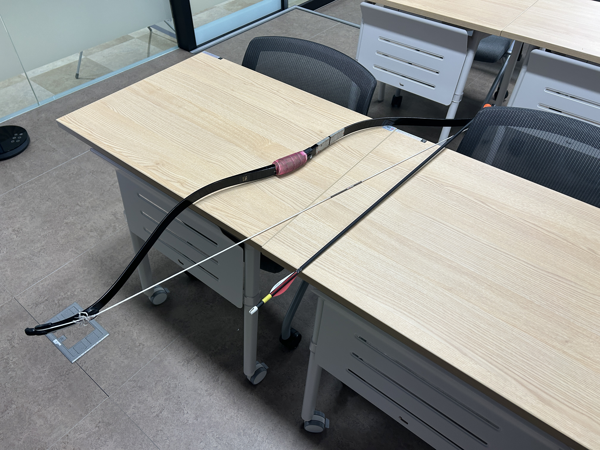
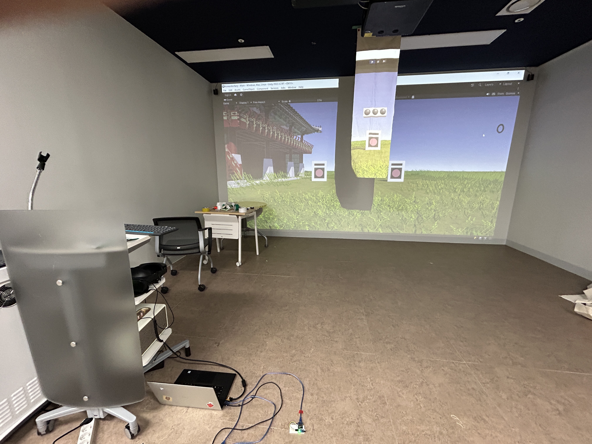

# VRKoreanArchery
Capstone Design - Kyung Hee University SWCON

## 국궁 실내 습사 프로젝트

Unity Version: 2022.3.23f1

### **Caution**

용량이 큰 에셋 파일은 포함되지 않았습니다!

따라서 git clone으로 다운 받을 시 오류가 발생합니다.

이 깃허브 장소는 소스코드를 보관 및 유지보수하는 곳입니다.

에셋이 포함된 전체 폴더는 최종제출 -> 실행파일 -> zip파일로 참조 부탁드립니다.

### 하는 방법

1. KoreanArchery_Final 파일 압축 풀기

2. 유니티 버전에 맞추어서 폴더 열기

3. 아두이노 설정하기 -> 설정 방법: https://github.com/FlightFly98/KoreanArchery_Arduino 의 ReadMe 참조.

4. 15파운드의 활, 본인 크기에 맞는 화살, 고무촉 준비 
    > 주의
    - 이 프로젝트는 국궁을 기반으로 합니다. (양궁 기준 x)
    - 국궁에 대한 기초 지식 및 작은 파운드라도 쏴본 경험이 있어야 합니다.

5. 빔 프로젝터, 충분한 안전 공간 확보(반드시 필수!)

6. 화살 충격 흡수를 막아줄 광목천 설치

예시)

7. 시작 후 입문 선택 (숙련자용은 아직 미개발)

8. 모든 아두이노 센서가 작동하는 지 확인 후

9. 활에 화살을 매기고 발시!